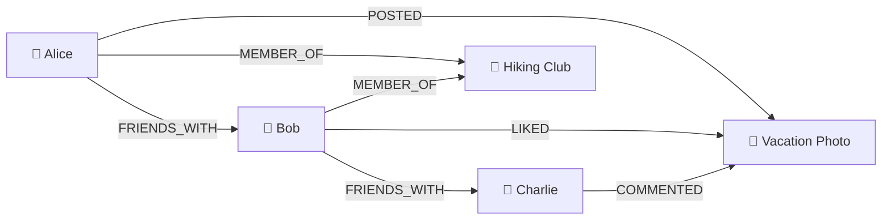
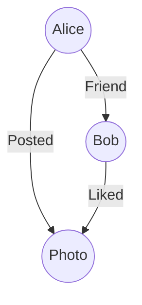

Software today is complex, and stores various kinds of data, with various diffeerent requirements. There are many specialized databases to handle very specific tasks well. The shape you store data in determines what's fast, what's easy, and what's painful. Here are a few of the different types.

## Relational (row store)

The classic: tables of rows and columns, connected by ids, with rules that
keep data honest. Stored row-by-row, which makes the everyday work of apps fast, 
look up *this* order, update *that* member. This is the default choice
for most software: [SQLite](https://sqlite.org/index.html), [PostgreSQL](https://www.postgresql.org/), [MySQL](https://www.mysql.com/) are the popular names.

## Columnar (column store)

The same tables, stored column-by-column instead. That sounds like a
technicality, but it changes everything for some workloads. Adding up one column across a
billion rows only has to read *that column*, not a billion whole rows.
[[columnar-database|Columnar databases]] power analytics and reporting. For when you want to know  "average order value per month for five years". Not impossible with other databases, but if this is your main workload, column-store's are faster than most alternatives, at the cost of being slower to update individual rows. Examples include : [DuckDB](https://duckdb.org/), [ClickHouse](https://clickhouse.com/clickhouse), [Amazon Redshift](https://docs.aws.amazon.com/redshift/latest/mgmt/welcome.html).

## Key-value

The simplest possible idea: a giant lookup of *[[key-value-store|key → value]]*. Imagine you want to store data about where a bunch of cars are for a valet service. A person is given the ticket `2204`, and the car is parked in `A26`. You give the database `2204:A26`, when they come back at the end of the night, you ask it for `2204` and it gives you back `A26`. No tables, no relationships, no questions other than "what's under this
key?". So, why? Speed. It's best suited for short lived data that needs ot be accessed fast. Used for caches, user sessions, and feature flags. Examples: [Worker KV](https://developers.cloudflare.com/kv/), [Redis](https://redis.io/), [Amazon DynamoDB](https://aws.amazon.com/dynamodb/).

## Document

Each record is a self-contained **[[document-database|document]]** (usually JSON-like): 

```json
{
  "name": "Ada Osei",
  "phone": "555-0141",
  "borrowed": ["Pride and Prejudice"]
}
```

All of a member's data in one nested bundle. There's no fixed list of columns, so records can vary in shape. Flexible for fast-changing data, at the price of duplication and weaker cross-record guarantees. Examples: [MongoDB](https://www.mongodb.com/), [CouchDB](https://couchdb.apache.org/).

## Graph

Some data *is mostly connections*. Who follows whom, what depends on what,
how A launders money to D through B and C. [[graph-database|Graph databases]] store **nodes**
(things) and **edges** (connections) directly:





Are built to answer "friend-of-a-friend"-style questions that require hopping many links. These are the kind of query that gets awkward in tables. Examples: [Neo4j](https://neo4j.com/), [Memgraph](https://memgraph.com/).

## Vector

The newcomer, riding the AI wave. Text, images, and audio can be converted
into long lists of numbers (**[[embedding|embeddings]]**) where similar meanings land near
each other. A highly specialized system, for highly specific tasks. These databases are inherently mathematical, which can make them hard to explain ([here](https://www.pinecone.io/learn/vector-embeddings/) is a good one). Here is an example:

Imagine you have data like:

```json
[
  {
    "id": 1,
    "text": "Dog Training",
    "embedding": [0.12, -0.48, 0.91, ..., 0.37]
  },
  {
    "id": 2,
    "text": "Puppy Care",
    "embedding": [0.15, -0.44, 0.89, ..., 0.35]
  },
  {
    "id": 3,
    "text": "Paris Travel",
    "embedding": [-0.82, 0.16, -0.27, ..., -0.71]
  }
]
```

The search then does something like this:

```
User Query
    │
    ▼
"How do I train my puppy?"
    │
    ▼
Embedding Model
    │
    ▼
[0.14, -0.46, 0.90, ..., 0.36]
    │
    ▼
Vector Database
    │
    ├── Puppy Care      similarity: 0.98
    ├── Dog Training    similarity: 0.96
    ├── Cat Nutrition   similarity: 0.82
    └── Paris Travel    similarity: 0.12
```

If we view this more visually you can imagine that "similarity" is how "close" embeddings are, so this might be a visual representation of the data:

```
     Semantic Space (2D illustration)
 
      Animals ↑
              │
              │        🐶 Dog Training
              │           ●
              │         ● Puppy Care
              │
              │  🐱 Cat Nutrition
──────────────┼────────────────────────→ Travel
              │
              │
              │                     ✈️ Paris Travel
              │                          ●
              │                       ● France Hotels
              │
              │                  🍝 Italian Recipes
              ▼
```

and the query would look something like this:


```
     Semantic Space

      Animals ↑
              │
              │      🔍 Query
              │         ★
              │        ↙
              │   ● Puppy Care
              │      ● Dog Training
              │
──────────────┼────────────────────────→ Travel
              │
              │
              │                     ● Paris Travel
              │                  ● France Hotels
              │
              │               ● Italian Recipes
```

A [[vector-database|vector database]] stores those lists and answers "what's most *similar* to this?". They power features that were traditionally difficult, and highly specialized like semantic search and retrieval for AI assistants. Examples: [Pinecone](https://www.pinecone.io/), [Qdrant](https://qdrant.tech/), and the [pgvector](https://github.com/pgvector/pgvector) extension for [PostgreSQL](https://www.postgresql.org/).

## [[time-series-database|Time-series]]

Built for endless streams of timestamped measurements, for things like server temperatures, heart rates, stock ticks. Optimized for "append constantly, query by time
range, summarize per minute/hour/day", with old data compressed or expired
automatically. Examples: [InfluxDB](https://www.influxdata.com/products/influxdb-overview/), [TimescaleDB](https://timescaledb.org/).

## Side by side

| Kind        | Data shape                  | Great for                                | Examples                        |
| ----------- | --------------------------- | ---------------------------------------- | ------------------------------- |
| Relational  | Tables, connected by ids    | Most applications; data with rules       | SQLite, PostgreSQL, MySQL       |
| Columnar    | Tables, stored by column    | Analytics over huge datasets             | ClickHouse, Redshift, DuckDB    |
| Key-value   | key → value pairs           | Caching, sessions; raw speed             | Redis, DynamoDB                 |
| Document    | Self-contained documents    | Flexible, fast-changing records          | MongoDB, CouchDB                |
| Graph       | Nodes and edges             | Networks, relationships, many-hop paths  | Neo4j, Memgraph                 |
| Vector      | Embeddings (number lists)   | Similarity search, AI retrieval          | Pinecone, Qdrant, pgvector      |
| Time-series | Timestamped measurements    | Metrics, sensors, monitoring             | InfluxDB, TimescaleDB           |

The debate around approach to use, and when is quite lively, and highly situational. Some people swear by a set of specialized databases, for others entire [movements](https://youjustneedpostgres.com/) have been created around just using relational databases with pluigns to meet your every need (with some [passionate believers](https://www.justfuckingusepostgres.com/)).

If in doubt, start relational. Relational is the general-purpose tool the rest were
specialized *away* from, and the one whose skills transfer everywhere. But, you might be thinking *sure **A** spreadsheet* doesn't work, but why bother
with any of this instead of a folder full of spreadsheets?
