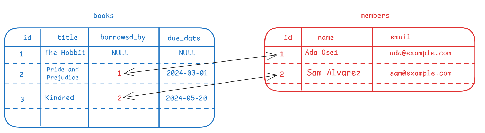

The spreadsheet workflow is *open the whole file, scroll, squint, filter by hand*. The database workflow is *opn a connection, describe the answer you want; receive exactly that, and nothing else*.

The star of that trick is the **join**: combining related tables at the moment you ask, using those id-based relationships from chapter one.

Back to our library. Books point at the members who borrowed them:

**members**

| id | name        | email             |
| -- | ----------- | ----------------- |
| 1  | Ada Osei    | ada@example.com   |
| 2  | Sam Alvarez | sam@example.com   |

**books**

| id | title               | borrowed_by | due_date   |
| -- | ------------------- | ----------- | ---------- |
| 1  | The Hobbit          | NULL        | NULL       |
| 2  | Pride and Prejudice | 1           | 2024-03-01 |
| 3  | Kindred             | 2           | 2024-05-20 |

*`NULL` just means empty*

Now the question every library asks daily: *"Which books are overdue, and
what's the borrower's email?"* Notice the answer lives in **neither table**,
titles and due dates are in `books`, emails in `members`. A join stitches
them together, matching each book's `borrowed_by` to a member's `id`, keeps
only the overdue rows, and returns just this:

| title               | name     | email           |
| ------------------- | -------- | --------------- |
| Pride and Prejudice | Ada Osei | ada@example.com |

In a database language it's one short request,  shown here just for flavour, not to learn yet:

```sql
SELECT books.title, members.name, members.email
FROM books
JOIN members ON members.id = books.borrowed_by
WHERE books.due_date < '2024-04-01';
```




Three things are worth noticing:

- **You never opened anything.** With a million books and a hundred thousand members, the database still hands back only the matching rows. The work of finding them happens inside the database, using clever code
- **The combination happens on demand.** Nobody maintains an "overdue books with emails" sheet that can go stale. It's computed fresh from the single authoritative copy, every time you ask.
- **Storing once, answering anything.** Facts live in exactly one place, yet any cross-table question can be answered. Who is the most borrowed author? How many members have nothing checked out? What is the average loan length? In spreadsheet land, each of those is a manual copy-paste-VLOOKUP project; here, each is one more question.

Asking is cheap. That, more than anything, is the everyday superpower.
